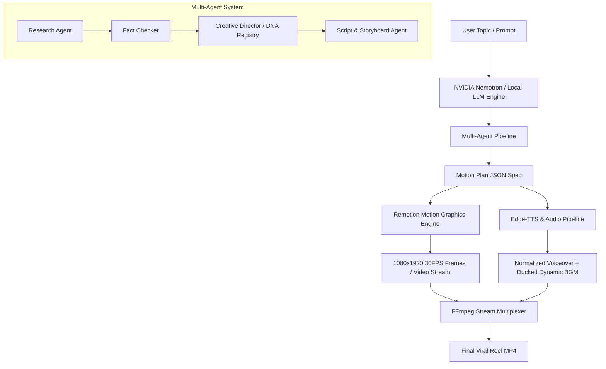

# 🎬 REEL STUDIO — AI-Native Motion Graphics Studio

> **Transform any technical concept, algorithm, code snippet, or math equation into high-retention, viral 9:16 motion graphic reels with cinematic animations, live execution simulations, and neural voiceover.**

[](https://www.python.org/downloads/)
[](https://www.remotion.dev/)
[](https://fastapi.tiangolo.com/)
[](https://react.dev/)
[](LICENSE)

---

## ⚡ Key Highlights

- **🧠 5-Beat Senior Engineer Story Arc**: Hooks audiences with zero fluff. Every video follows a high-impact narrative: *High-Stakes Hook ➔ Live Code Execution ➔ Deep Physical Simulation ➔ Hardware/Pipeline Reality ➔ Senior Takeaway*.
- **💻 Live Code Scanner & Terminal**: Dynamic multi-language syntax highlighting (Java, Python, C++, Go, Rust, JS/TS, SQL), laser line scanners, real-time variable watchers (`x = 10`), and an interactive floating terminal showing actual compiler & runtime outputs.
- **🔮 Real Kinetic Simulations**:
  - **Electric Decision Gate**: High-speed circuit bus with real branch-prediction commit/skip telemetry.
  - **Holographic Array Visualizer**: Dynamic partition scanning with `LOW`, `MID`, `HIGH` pointers.
  - **Call Stack Elevator**: 3D isometric stack frames allocating stack/heap memory.
  - **Loop Turbine**: Kinetic high-velocity turbine measuring iteration frequency.
- **📐 2D-to-3D Math Engine**: Formulates KaTeX LaTeX equations and morphs them into 3D wireframe parametric surfaces (Sinc Wave, Ripple, Hyperbolic Saddle).
- **🎙️ Neural TTS & Dynamic Audio Ducking**: High-fidelity neural voiceover (`en-US-ChristopherNeural`) paired with procedural sound effects and automated audio ducking (-12 dB) to keep voice crystal clear.
- **🖥️ Full Modern Web Studio & CLI**: Web UI (`http://localhost:5055`) with live server-sent progress, storyboard inspector, video player, and master audio audition bar.

---

## 🏗️ Architecture Pipeline



---

## 🚀 Quickstart (One Command Setup)

### Prerequisites
Make sure you have installed:
1. [Python 3.10+](https://www.python.org/downloads/)
2. [Node.js 18+](https://nodejs.org/) (includes `npm`)
3. [FFmpeg](https://ffmpeg.org/download.html) (available on system `PATH`)

### 1. Clone the Repository
```bash
git clone https://github.com/Sweekar-m/prompt_reel.git
cd prompt_reel
```

### 2. Run Automated Setup (1-Click)

**On Windows:**
```bat
setup.bat
```

**On Linux / macOS:**
```bash
chmod +x setup.sh
./setup.sh
```

*(This automatically installs all Python dependencies, compiles Remotion npm packages, and creates your `.env` configuration file).*

---

## 🔑 Bring Your Own Key (BYOK)

Reel Studio supports cloud LLM reasoning with NVIDIA NIM (Nemotron) or runs 100% offline out-of-the-box.

1. Open `.env` in any text editor:
```env
# Optional: NVIDIA NIM API Key (Get free trial credits at https://build.nvidia.com)
NVIDIA_NIM_API_KEY=your_key_here

NVIDIA_NIM_BASE_URL=https://integrate.api.nvidia.com/v1
NEMOTRON_MODEL=meta/llama-3.2-11b-vision-instruct
REEL_PORT=5055
```

> **Note**: If `NVIDIA_NIM_API_KEY` is left blank, Reel Studio automatically falls back to its built-in offline deterministic expert engine. No API key is required to test and render!

---

## 💻 How to Run

### Option 1: Web Studio (Recommended)
Launch the interactive web UI:

**Windows:**
```bat
reel
# or
.\reel.bat
```

**Cross-Platform:**
```bash
python generate_reel.py
```

Open your browser at **[http://localhost:5055](http://localhost:5055)**. Type any concept (e.g. *"If statement in Java"*, *"Binary search array"*, or *"2d to 3d sinc wave"*) and click **Generate Reel**.

### Option 2: Command Line (CLI)
Generate a reel directly from the terminal:
```bash
python generate_reel.py --topic "How Garbage Collection Works in Java"
```

Options:
- `--topic "<str>"`: Topic to generate
- `--port <int>`: Custom port (default: 5055)
- `--no-browser`: Start server without auto-opening default browser
- `--version`: Display version information

### Option 3: Remotion Live Dev Preview
Inspect and tweak React motion graphic components in real time:
```bash
cd remotion
npx remotion preview
```

---

## 📂 Project Structure

```
prompt_reel/
├── agents/                  # Multi-agent system (Research, Fact Check, Creative Director, Quality)
├── ai/                      # LLM clients (Nemotron, NVIDIA NIM, Offline Fallback)
├── assets/                  # Typography & Fonts (JetBrains Mono, Inter)
├── audio/                   # Procedural audio generator & sound design
├── audio_pipeline.py        # Edge-TTS voice synthesis & dynamic audio ducking
├── cli/                     # CLI entry points and terminal banners
├── config.py                # Video canvas, timeline, and audio configurations
├── engine/                  # Video DNA registry & deterministic scene builders
├── remotion/                # React Remotion Motion Graphics Engine
│   ├── src/
│   │   ├── components/      # CodeScene, MetaphorScene, DiagramScene, Math3DScene, etc.
│   │   ├── ReelComposition.tsx
│   │   ├── ReelVideo.tsx
│   │   └── Root.tsx
│   └── package.json
├── renderer/                # Multi-core Remotion render executor & progress bridge
├── server/                  # FastAPI web server and SSE streaming routes
├── styles/                  # 15 creative style specifications (Cyberpunk, Editorial, etc.)
├── web/                     # Single Page Web Studio interface
├── .env.example             # Environment variable template
├── requirements.txt         # Pinned Python dependencies
├── setup.bat / setup.sh     # One-click installation scripts
└── README.md
```

---

## 🛠️ Troubleshooting

- **Audio not audible?**
  Ensure FFmpeg is installed and added to your `PATH`. Test with `ffmpeg -version`.
- **Render too slow?**
  Reel Studio automatically uses multi-core rendering (`os.cpu_count() // 2`). For ultra-fast previews, use `npx remotion preview` in the `remotion/` directory.
- **Port already in use?**
  Start with a custom port: `python generate_reel.py --port 8080`.

---

## 📄 License
This project is open-source under the [MIT License](LICENSE).
